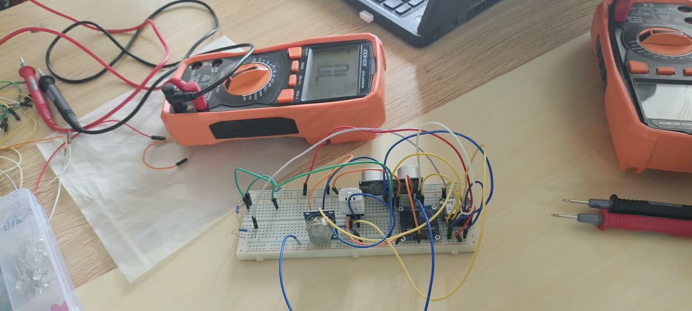
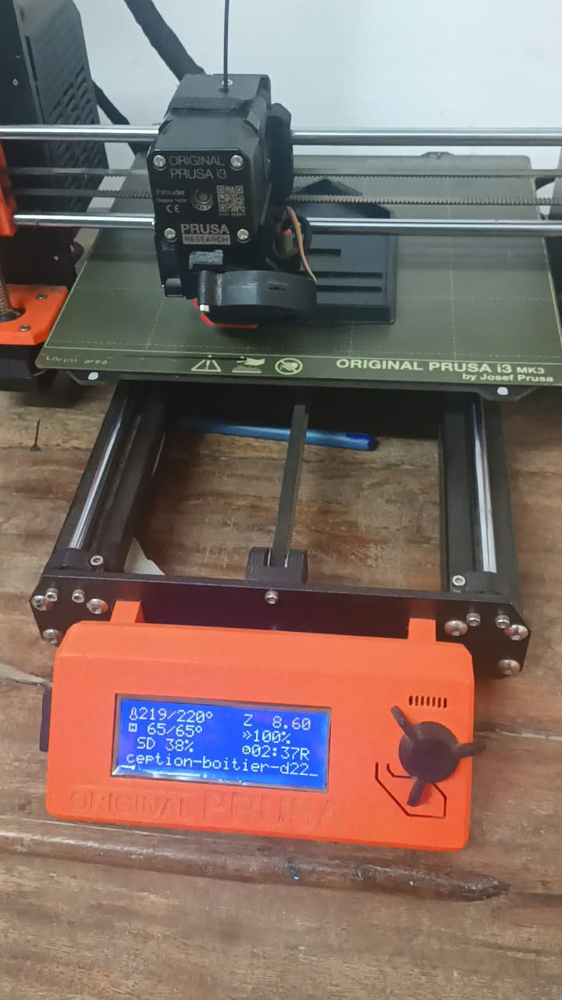
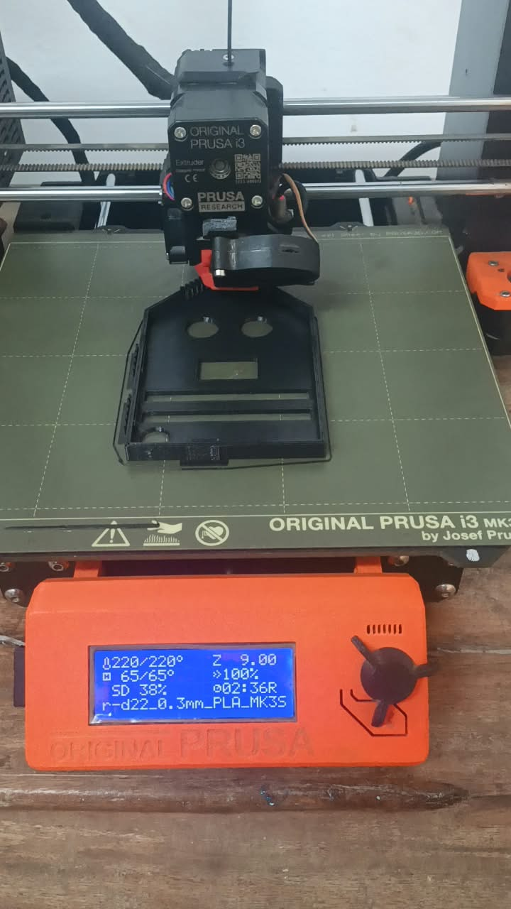

# Fiche projet — Équipe 022

> Livrable L2 · Jalon J1 (samedi 29 août 2026) · validée par l'encadreur référent.
> Aucune fabrication n'est autorisée avant la validation de ce jalon.

## 1. Dispositif D 022  (Detecteur de qualité de l'air et de temperature en Fablabs et en classe )

Nom du dispositif, une phrase pour le présenter à un chef d'établissement.
AirClass - Staion de surveillance de la qualité de l'air et de la temperature pour fablab et salle de classe

phrase : AirClass permet aux eleves et encadreurs de surveiller en temps réel la qualité de l'air et la temperature pour garantir un environnement de travail sain et securisé.

## 2.  Besoin et bénéficiaires

- Les fablabs et les eleves en permanence ont besoin de savoir la qualité de l'air ainsi que la temperature 
- ce dispositif va etre installer dans les fablabs et les salle de classe pour prevenir les risque liées aux CO2 et a la surchauffe.

## 3. Objectifs d'apprentissage

Trois objectifs observables rattachés au programme officiel, chapitre cité.

1. Réaliser et programmer un systéme embraqué a base de microcontroleur XIAO ESP32-S3 pour acquerir des données de capteurs. Chapitre : Systéme embarqués
2. analyser les données de CO2 et de temperature pour determiner 3 niveaux d'alerte et prendre une decision. Chapitre : traitement de l'information
3. communiqué les resultats via un ecran OLED er des LEDs pour sensibiliser les utilisateurs .
 Chapitre :  Interfaces Hommes - Machines 

## 4. Description du dispositif

Ce que l'objet fait :
- mesurer la concentration du dioxyde de carbone dans l'air avec le MQ-135;
- mesurer la temperature et l'humidité avec le DHT22
- afficher 03 niveau d'alerte du CO2 et la temperature

 ce que l'élève fait avec :
 - l'eleve exploite  des données pour prendre les decision ( aérer la salle et déclancher une alarme)
 - fonctionner hors reseau :stockage local + alimentation USB / batterie.
  croquis ou esquisse annotée
  

  

  

  

  

   

<video controls src="../medias/simulation avec les lumiere.mp4" title="Title"></video>

## 5. Architecture technique pressentie

Capteurs :
 - Un capteur de dioxyde de carbone à mesure infrarouge non dispersive,
 - un capteur de temperature

  actionneurs :
  - les LEDS
  - le BUZZER
  - l'ECRAN

  - liaison :
  - les PCB 
  - les CABLES

   application :  procédés de fabrication envisagés
(au moins trois procédés distincts, exigence ET-FAB-02).
- impression additive
- impression soustrative 
- impression traditionnel

 application
 - fusion 360
 - VScode
 - Mblock

 
## 6. Rôle des élèves

Position sur le continuum POUR / AVEC / PAR et extension PAR décrite (exigence EP-03).

POUR les élèves : Le dispositif est conçu pour eux. Il surveille la qualité de l'air pour garantir leur santé et leur concentration en classe et au Fablab.

AVEC les élèves : Les élèves participent aux tests, à l'étalonnage des capteurs MQ-135 et DHT11, et à l'interprétation des 3 niveaux d'alerte CO2.

PAR les élèves : Les élèves assemblent le PCB, impriment le boîtier en 3D, programment le XIAO ESP32-S3 et installent le dispositif dans les salles.

Extension PAR : Les élèves forment d'autres classes à l'utilisation du dispositif et proposent des améliorations logicielles.

## 7. Ancrage réseau et implantation

Lab de rattachement 
- CRIT 
-  établissement 

· lieu d'usage 
- fablabs et salle de classe

· conditions matérielles de la salle.
- Salle hermétiquement fermée, sans ventilation mécanique, pour tester l'accumulation de CO2

## 8. Périmètre

| | Contenu |
|---|---|
| Dans la v1.0 (Socle) |un boitier fonctionel |
| En option (Avancé / Expert) | controle de la temperature ,de l'aération; et la notification automatique  |
| Explicitement exclu | Reprogrammation via le réseau|

## 9. Risques et parades

| Risque | Type | Parade |
|---|---|---|
|defaut de capteur  | technique | test et redondence  |
|insuffissance de temps  | calendrier | faire des prototype tres simple|
|manque de competence  | pédagogique | sous-traitance  |

## 10. Budget matière estimé

Grandes masses en FCFA, au regard de la dotation (plafond indicatif : 60 000 FCFA): 60.000 FCFA

## 11. Licences et diffusion

Licences choisies et motivation :open  Sources 
accord de l'équipe pour la mise en avant réseau: poster sur hitHub en public

## Exemptions demandées

- [ ] ET-FAB-06 (moulage) — justification :
- [ ] ET-MEC-01 (fonction motorisée) — justification :
