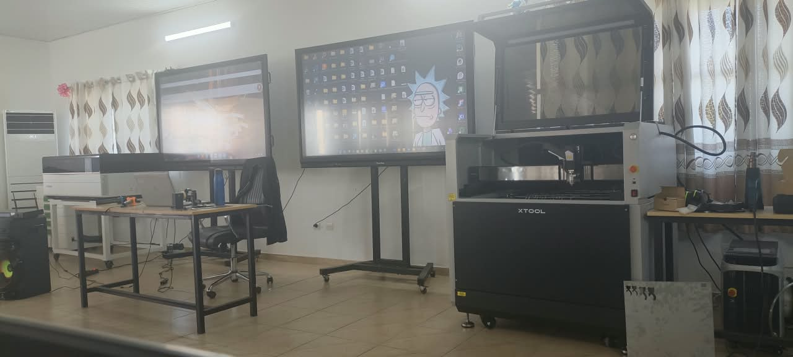
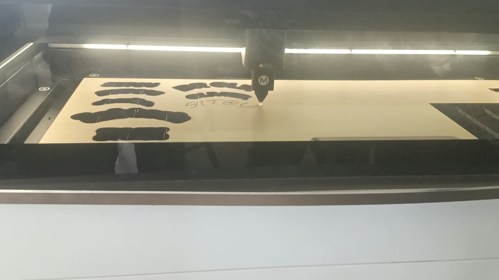
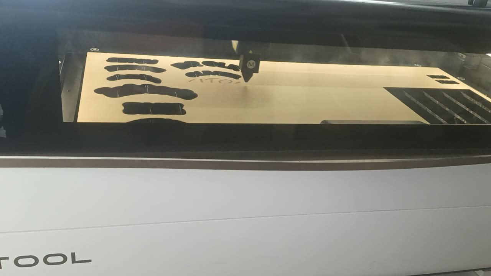

# journal DU 26-08-2026 (rédigé par : ATTI IDRISSOU)

## Fait aujord'hui
 -b controle de présence 
- repartition des fabmanagers en 4 groupe de + OU- 24 personnes.
- 4 Rotation de 2heures dans differentes salles
- les cours se sont déroulé en 4 etapes
- cours sur l'impresiion 3D
- cours sur l' elaboration de projet
- cours sur la decoupe laser
- cours sur l'electronique

## Appris
EN impresion 3D que : les filaments resisite a l'eau,au soleil et a la chaleur
nous disposonds des filaments: PLA fait a base d'amidon ; PET a base de la matiére plastique et PETG : matiére plastique + glicole et ABS pour les hydrocarbure.
l'une des machine a impresion 3D fait fondre le filament a 230°c

### Les 4 paramètres clés à prendre en compte pour imprimer du PET / PETG :
1. Température de fusion
- Buse / Nozzle : 230°C à 250°C  
  Le PET fond vers 250°C. Trop froid = bouchage. Trop chaud = il jaunit et dégage des odeurs.
- Plateau : 70°C à 85°C  
  Pour que la 1ère couche accroche et éviter que ça gondole.

2. Vitesse d'impression
- Vitesse conseillée : 40 à 60 mm/s  
  Le PET est un peu "collant". Si tu vas trop vite à 100mm/s ça fait des fils et mauvaise précision.
- 1ère couche : 20 à 30 mm/s pour bien accrocher

3. Refroidissement du filament
- Ventilateur : 30% à 50% seulement  
  Contrairement au PLA, le PET n’aime pas trop de froid. Trop de ventilo = couches qui se décollent.  
  Pas de ventilo du tout = bave et mauvais aspect.
- Laisse refroidir doucement pour éviter le retrait

4. La précision
- Hauteur de couche : 0.2mm pour un bon compromis solidité/précision
Additive : on ajoute la matiere sur la matiére
soustrative: on retire la matiére  a partir d'un bloc brut par usinage mecanique
traditionnelle : on met en forme la matiére viea un outillage dédie (moule ,matrice)
definition de CNC : Computer Numerique Control
  
### Elaboration de projet 
- A prendre en compte :
perioherie d'entrée et de sorti
micro- controleur
circuit imprimé : fraise

### Decoupe laser

(3 technologiie et 4 decoupe laser)
Metal Fab,P3,F2 Ultra et M1 Ultra

## RATE,puis corrigé
-difficulté d'inserer les images dans le journal
-aprés plusieurs essai je me suisretrouvé

## A FAIRE DEMAIN 
### CONTUNUITE DES ACTIVITES
4 Rotation de 2heures dans differentes salles
- cours sur l'impresiion 3D
- cours sur l' elaboration de projet
- cours sur la decoupe laser
- cours sur l'electronique