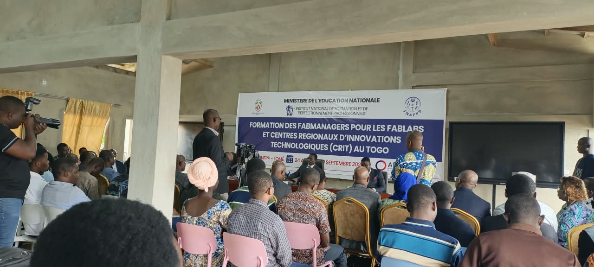

# journal DU 24-08-2026 (rédigé par : ATTI IDRISSOU)  
## Matin
### 9H00 - arrivée des officiels
(Directeur de l'institut de formaton INFPP,representant du FNAFPP et du MEN et d'autrres responsable)
### 9H15- installations des officiels
Mot de bienvenue du Directeur de l'institut de formaton,representant du FNAFPP et du MEN

### 9H30 - Ouverture de la Formation des FABMANAGERS
### 10H00 - Presentation des formateurs
.Chaque ses presenter  (**nom, prenom et titre**)
.Presentation des futurs fabmanagers (nom ,prenom et spécialité)
### 10H30 - Debut de la formation
Documenter avec Git,GitHub et GitHub Pages
### 12H30 - Pause 
Durée de la pause 1H 
## Midi

### 13H30 Reprise de la formation
.copie et installation des logiciles 
.EXtraction d'un document ZIP
.la pratique de visual viscode code 
### 17H15 FIN DE LA JOURNEE
Cessation des activités