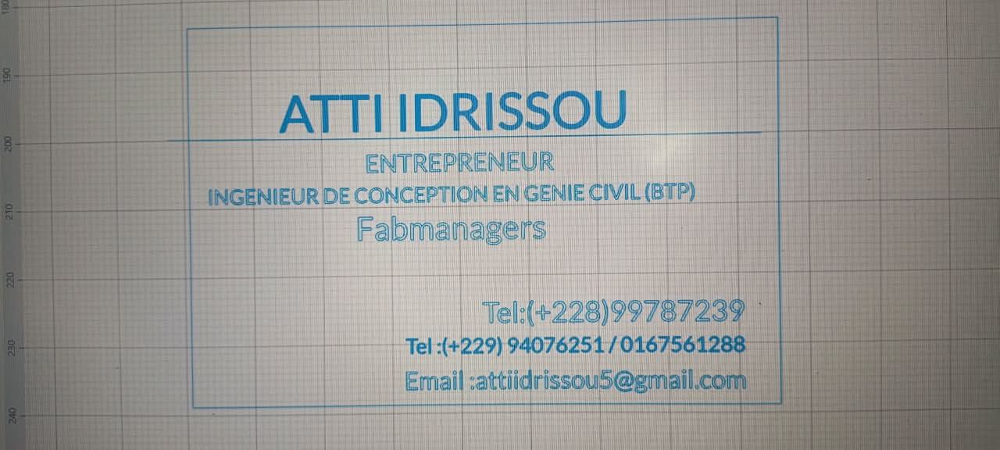
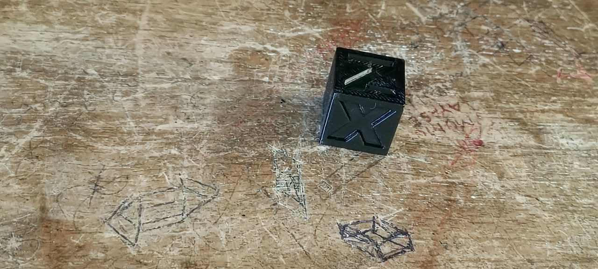

# journal DU 24-08-2026 (rédigé par : ATTI IDRISSOU)
## Fait aujord'hui
 -b controle de présence 
- repartition des fabmanagers en 4 groupe de + OU- 24 personnes.
- 4 Rotation de 2heures dans differentes salles
- les cours se sont déroulé en 4 etapes
- cours sur l'impresiion 3D
- cours sur l' elaboration de projet
- cours sur la decoupe laser
- cours sur l'electronique

 # Appris
 - apprendre a travailler avec le (logiciel xTOOL-Studio)
 - A travers ce logiciel nous avons appris la conception des cartes de visites format (85mm X 55mm)
 
 
- en electronique nous avons eu a utilisé (V5.6.0 / mBlock)
- identifier les composants du CyberPi et les principaux modules mBuild
distinguer un capteur d'un actionneur dans une chaine d'acquisition / action
Cabler et programmer un montage avec mBlock 5(blocs puis Python)
- Realiser au moin 3 projets simples combinant actionneur et capteur 
- Utilisation du logiciel (Bambu studio)
- Impresson 3D
- 

## A FAIRE DEMAIN 

### CONTUNUITE DES ACTIVITES
4 Rotation de 2heures dans differentes salles
- cours sur l'impresiion 3D
- cours sur l' elaboration de projet
- cours sur la decoupe laser
- cours sur l'electronique