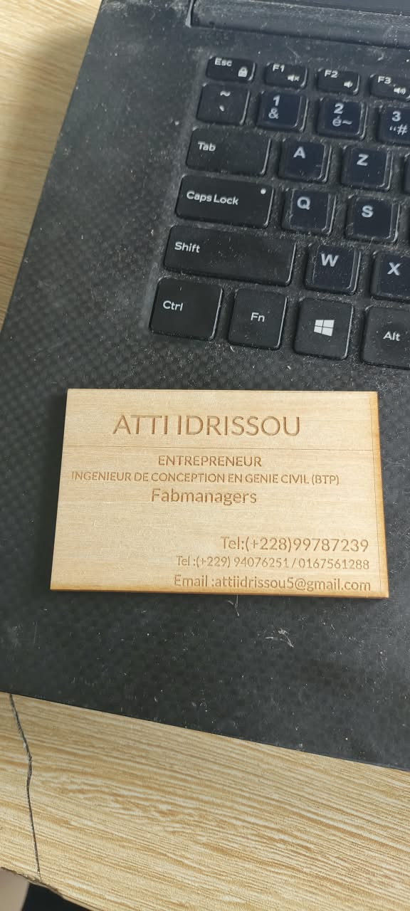

# journal DU 28-08-2026 (rédigé par : ATTI IDRISSOU)

## Fait aujord'hui
 - controle de présence 
- repartition des fabmanagers en 4 groupe de + OU- 24 personnes.
- 4 Rotation de 2heures dans differentes salles
- les cours se sont déroulé en 4 etapes
- cours sur l'impresiion 3D
- cours sur l' elaboration de projet
- cours sur la decoupe laser
- cours sur l'electronique

 # Appris
 - conception et impression des cartes d'invitation avec la decoupe laser
 
conception  et impression des portes portable avec l'imprimante 3D
- module sur le design thinking et la methode spirale .
- cours sur les bonne conduite du processus avec les eleves
- 4 Quatre boucles sur un projet du programme

## A FAIRE DEMAIN 

### CONTUNUITE DES ACTIVITES
-  Mise a disposition des Fabmanagers des thémes
-  Reflexion individuel sur les differents themes
-  Reflexion collectif sur les differents themes
-  Reflexion et explication des differents theme par les responsable du groupe .
