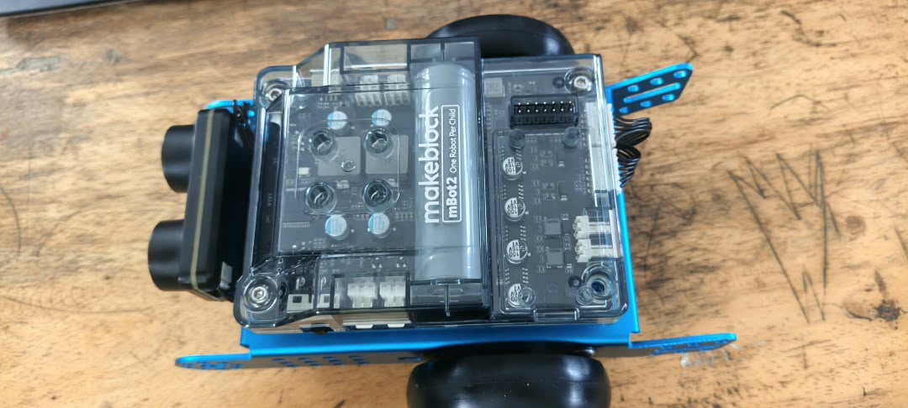
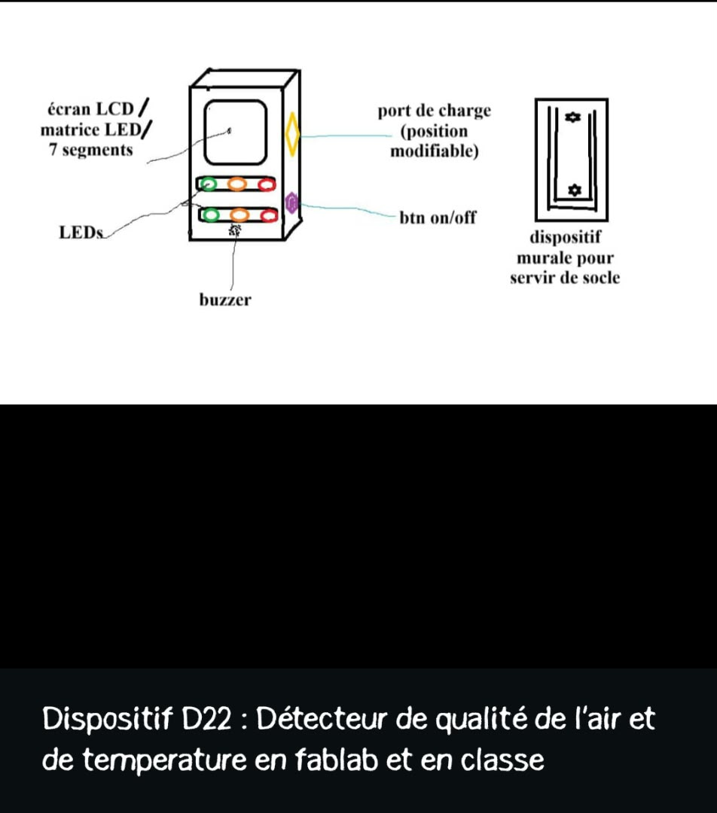

# journal DU 02-09-2026 (rédigé par : ATTI IDRISSOU)

## Fait aujord'hui
 - controle de présence 
- repartition des fabmanagers en 3 groupe , un de 48 et deux de 24 personnes pour la contunité
-  Reflexion individuel sur les differents themes
-  Reflexion collectif sur les differents themes
-  Reflexion et explication des differents theme par les responsable du groupe .
- esquise des differents vu du montage 
- fondendamentaux pour les futurs fabmanagers
- Makeblock mBot2 

 # Appris
 - Makeblock mBot2 (montage du cerveau du robot éducatif Makeblock)
 
 
 - Besoin technique du projet (Detecteur de qualité de l'air et de tempterature en fablabs et en classe)
 
 - creer un nouvelle conception
 - faire un esquisse 2D
 - passer en 3D
 

 ## Salle electronique 
 - montage de base sur breadboard avec une ou deux LED
 - Notion de base de l'electronique et pratique sur quelque montage en serie 
 
 
## salle de decoupe Laser 
 - faire du Mockup DE T-shirt personnalisé
 
 - Imprimer textile
 
 

 ## A FAIRE AVANT LA NUIT
 - suivre les tuturiel sur fusion 360  

### CONTUNUITE DES ACTIVITES

- Finalisation des differents theme
-  Besoin technique du projet afin de pouvoir mettre a disposition de chaque groupe le materiel necessaire.