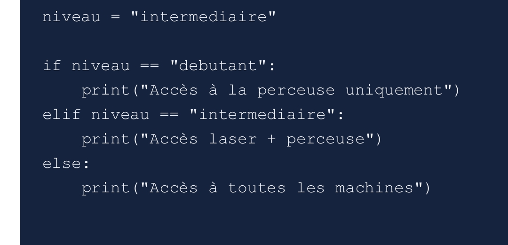
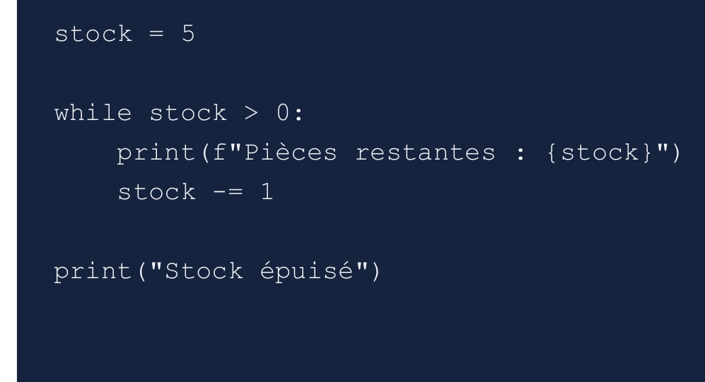
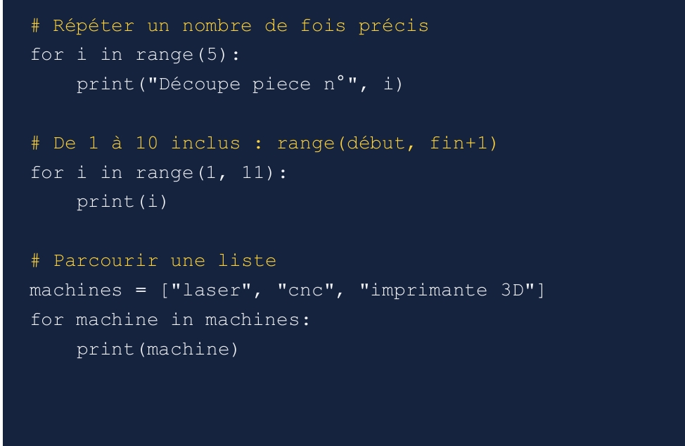

# journal DU 04-09-2026 (rédigé par : ATTI IDRISSOU)

## Fait aujord'hui
 - controle de présence 
- repartition des fabmanagers en 3 groupe , un de 48 et deux de 24 personnes pour la contunité
-  Reflexion individuel sur les differents themes
-  Reflexion collectif sur les differents themes
-  Reflexion et explication des differents theme par les responsable du groupe .
- esquise des differents vu du montage 
- 

 # Appris
 - 

 

 ## A FAIRE AVANT LA NUIT
 - suivre les tuturiel sur fusion 360 
 - reprendre les exercice sur thonny 

### CONTUNUITE DES ACTIVITES

- Finalisation des differents theme
-  Besoin technique du projet afin de pouvoir mettre a disposition de chaque groupe le materiel necessaire.