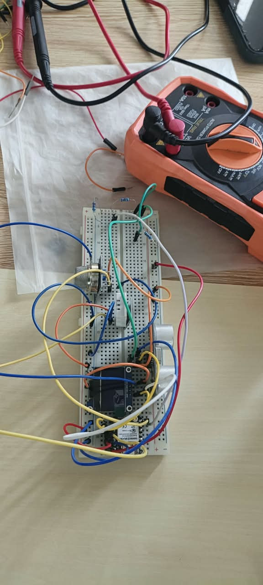
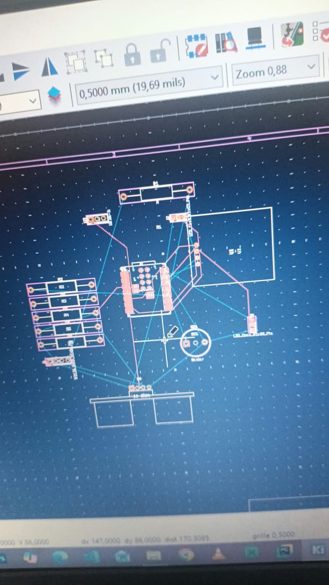

journal DU 15-09-2026 (rédigé par : ATTI IDRISSOU)

## Fait aujord'hui
 - Controle de présence 
 - Distribution des PC
 - Travaux de groupe sur des differents projets encadré par les superviseurs
 - Groupe 22: PROJET DETECTEUR DE QUALITE D'AIR (CO2 ET TEMPERATURE) EN CLASSE ET EN FABLABS
- PRESENCE DE LA TELEVISION NATIONAL (TVT)
 # Appris

### PROJET DETECTEUR DE QUALITE D'AIR (CO2 ET TEMPERATURE) EN CLASSE ET EN FABLABS
- Faire le montage du circuit sur un breadbord 

  

  

- Faire la programmation sur wokwi.com
-Conception d'un prototype de la facade principal de notre boitier
  impression 3D

- Conception d'un prototype de la facade principal de notre boitier
impression sur X-TOOL

  

  

  

- Manipulation du fer a soudé

support de soudure : plaque d'essai nperforé e double face ,pas de 2,54mm ,5x7cm

- Soudure sur les plaques perforer  ou plaques a pastilles 

 ## A FAIRE AVANT LA NUIT
 - Suivre les tuturiel sur kiCad , thonny et fusion 360.

### CONTUNUITE DES ACTIVITES
Projet de groupe:
- Groupe 22: PROJET DETECTEUR DE QUALITE D'AIR (CO2 ET TEMPERATURE) EN CLASSE ET EN FABLABS
- Assemblage du circuit
- montage du dispositif
- Contunité avec le PCB